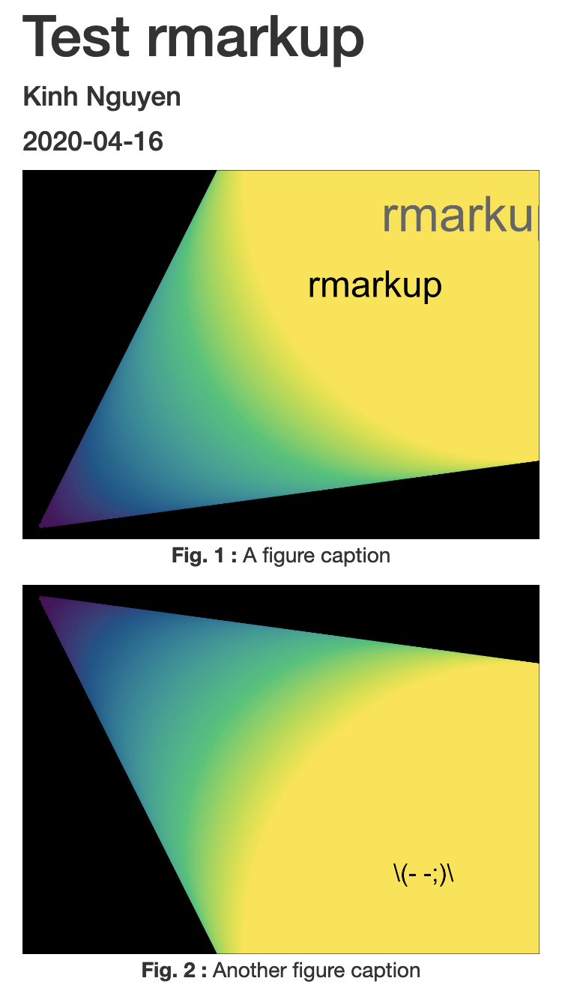

# rmarkup

Stylize Rmarkdown html outputs with predefined css, this does nothing except add css to the html output.

## Installation

You can install the development version of rmarkup from here with:

``` r
devtools::install_github("kklot/rmarkup")
```

## Example

Numbering and centering caption with bold leading label (default)

``` r
library(rmarkup)
render_with_style('TEST.Rmd', "figure_caption_numbering_centering")
```



## See list of styles

``` r
list_css()
```

Contribute by adding to `css.R`

## Use custom style

``` r
my_css <- 'body {background-color: #FCF4DC; }'
render_with_style(
    'TEST.Rmd',
    use_css = 'my_css', # need to quote
    output_file='~/test.html')
```

